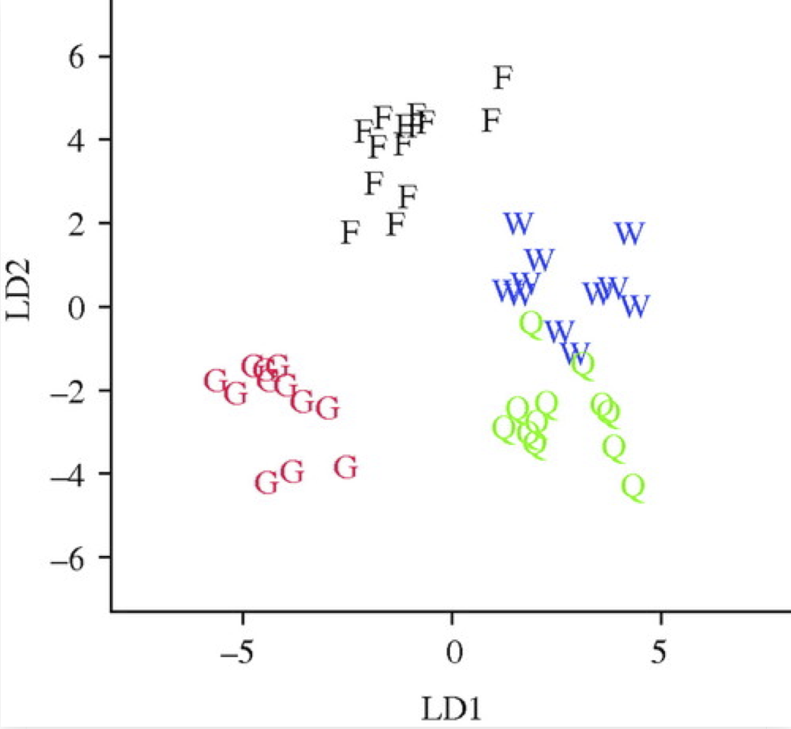
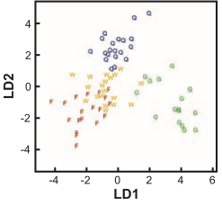
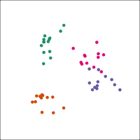
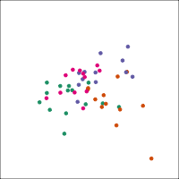

```{r initial, echo = FALSE, cache = FALSE, warning = FALSE, message = FALSE, error=FALSE, results = 'hide'}
library(knitr)
options(htmltools.dir.version = FALSE, tibble.width = 60)
opts_chunk$set(
  message = FALSE, 
  warning = FALSE, 
  error = FALSE, 
  echo = FALSE,
  out.width = "100%",
  fig.retina = 3
)
library(tidyverse)
library(kableExtra)
```

```{r xaringan-themer, include=FALSE}
library(xaringanthemer)
solarized_light(
  text_font_family = list(google_font("Lato")),
)
library(tidyverse)
```

class: inverse middle
background-image: url(images/wasps.gif)
background-position: 90% 90%
background-size: 30%

# Building plots to explore data

## *Beyond histograms, barcharts and scatterplots to high-dimensions and statistical inference*

### Professor Di Cook <br> Monash University

### WSC 2019, Kuala Lumpur <br>Aug 23, 2019

Slides can be viewed at <br> [http://dicook.org/files/WSC2019/slides#1](http://dicook.org/files/WSC2019/slides#1)

---
# How many clusters do you see?

.pull-left[

]
--
.pull-right[

<br>
<br>
<br>
<br>
<br>
<br>
<br>
<br>
.large[.green[... Hold onto this thought ...]]
]
---

```{r load libraries and look at wasps data}
library(knitr)
library(tidyverse)
library(nullabor)
library(tourr)
library(RColorBrewer)
library(MASS)
library(ggthemes)
data(wasps)
```


.large[I'm going to talk about]

--

`r anicon::faa("hand-pointer", size=2, speed="slow", animate="float", colour="#75A34D")` .large[.purple[inference for data plots]]

--

`r anicon::faa("hand-peace", size=2, speed="slow", animate="vertical", colour="#75A34D")` .large[.orange[with a focus on high-dimensional data,]]

--

`r anicon::faa("hand-spock", size=2, speed="slow", animate="wrench", colour="#75A34D")` .large[.green[and the use of tours]]

---
background-image: url(images/vis_inf.png)
background-size: contain

---
# Visual inference

1. the plot is a statistic
--

2. the type of plot (specified by a grammar) implicitly defines the null hypothesis
--

3. a null generating mechanism provides draws from the sampling distribution, among which to embed the data plot
--

4. human observers are engaged to examine a lineup 
--

5. statistical significance and power can be computed based on the proportion of observers choosing the data plot from the lineup

---
# Lineup protocol

I'm going to show you a page of plots

--

Each has a `r anicon::nia("number", size=1, speed="slow", animate="vertical", colour="#75A34D")` above it, this is its id

--

Choose the plot that you think exhibits the `r anicon::nia("most separation", size=1, speed="slow", animate="vertical", colour="#75A34D")` between groups

--

*If you really need to choose more than one, or even not choose any, that is ok, too*

--

`r anicon::nia("Ready?", size=2, speed="slow", animate="vertical", colour="#75A34D")`

---

```{r lineup of the wasps, out.width="100%", fig.width=9, fig.height=4.5}
wasp.lda <- lda(Group~., data=wasps[,-1])
wasp.ld <- predict(wasp.lda, dimen=2)$x
true <- data.frame(wasp.ld, Group=wasps$Group)

set.seed(20190823)
wasp.sim <- data.frame(LD1=NULL, LD2=NULL, Group=NULL, .n=NULL)
for (i in 1:20) {
  x <- wasps
  x$Group <- sample(x$Group)
  x.lda <- lda(Group~., data=x[,-1])
  x.ld <- predict(x.lda, dimen=2)$x
  sim <- data.frame(x.ld, Group=x$Group, .n=i)
  wasp.sim <- rbind(wasp.sim, sim)
}

pos <- sample(1:21, 1)
d <- lineup(true=true, samples=wasp.sim, pos=pos)
ggplot(d, aes(x=LD1, y=LD2, colour=Group)) + 
  facet_wrap(~.sample, ncol=7, scales = "free") +
  geom_point() + 
  scale_colour_brewer(palette="Dark2") +
  theme(aspect.ratio=1, legend.position="none",
        axis.title = element_blank(),
        axis.text.x = element_blank(),
        axis.text.y = element_blank(),
        panel.spacing.x=unit(1, "lines"),
        panel.spacing.y=unit(1, "lines"))
```

`r countdown::countdown(1, font_size="1em", top="85%", left="45%")`
---

.pull-left[
The data plot is 

```{r true wasp data plot, out.width="90%", fig.width=3, fig.height=4}
ggplot(true, aes(x=LD1, y=LD2, colour=Group)) + 
  geom_point() + 
  scale_colour_brewer(palette="Dark2") +
  theme(aspect.ratio=1, legend.position="bottom")
```
]
.pull-right[


It is the same data, as shown before. But I think that no-one noticed this. 
]

---

.pull-left[


> LDA resulted in ... that gynes had the most divergent expression patterns

.footnote[Toth et al (2010) Proc. of the Royal Society]
]

--

.pull-right[


> ... show that foundress and worker brain profiles are more similar to each other than to the other groups.

.footnote[Toth et al (2007) Science]
]

---

.pull-left[
True data 

```{r true wasp data plot again, out.width="90%", fig.width=3, fig.height=3}
ggplot(true, aes(x=LD1, y=LD2, colour=Group)) + 
  geom_point() + 
  scale_colour_brewer(palette="Dark2") +
  theme(aspect.ratio=1, legend.position="none")
```
]
.pull-right[

Null data

```{r null wasp data plot, out.width="90%", fig.width=3, fig.height=3}
ggplot(d %>% filter(.sample==7), aes(x=LD1, y=LD2, colour=Group)) + 
  geom_point() + 
  scale_colour_brewer(palette="Dark2") +
  theme(aspect.ratio=1, legend.position="none")
```

]
---
class: inverse middle center

Space is big, and with few data points, classes can easily be separated

--

`r anicon::nia("spuriously", size=1, speed="slow", animate="wrench", colour="#B86BB3")`

--

<br>
<br>

`r anicon::nia("The lineup protocol can help people understand the problem", size=2, speed="slow", animate="vertical", colour="#75A34D")`

---

If you first do dimension reduction (e.g. PCA), and then LDA, the problem goes away. LDA into three dimensions shown below. 

.pull-left[

All data



]
.pull-right[

Top 12 PCs



]
---
class: inverse middle center

.large[`r emo::ji("sweat")`]

Now we were worried about our own RNA-Seq analyses!

---
# Lineup of our own data

I'm going to show you a page of plots

--

Each has a `r anicon::nia("number", size=1, speed="slow", animate="vertical", colour="#75A34D")` above it, this is its id

--

Choose the plot that you think exhibits the 
- `r anicon::nia("steepest green line", size=1, speed="slow", animate="vertical", colour="#75A34D")` 
-  with relatively `r anicon::nia("small spread", size=1, speed="slow", animate="vertical", colour="#75A34D")` of the green points 

--

`r anicon::nia("Ready?", size=2, speed="slow", animate="vertical", colour="#75A34D")`

---
background-image: url(images/plot_turk9_interaction_2_1.png)
background-position: 50% 85%
background-size: 75%

---
background-image: url(images/RNASeq_disagreement.png)
background-position: 90% 15%
background-size: 40%

Experimental design 2x2 factorial:

- Two genotypes (EV, RPA)
- Two growing conditions (I, S)
- Three reps for each treatment
- Approx 60,000 genes

Results from two different procedures, edgeR and DESeq provided conflicting numbers of significant genes, but on the order of 300 significant genes.

One of the top genes was selected for the lineup study, and independent observers engaged through Amazon's Mechanical Turk. 
---
# Turk results

`r anicon::nia("Is there any significant structure in our data?", size=2, speed="slow", animate="pulse", colour="#B86BB3")`

--

- 24 lineups were made, only one shown to an observer
- 5 different positions of the data plot
- 5 different sets of null plots


Small number of observers engaged to evaluate the lineups

---

.pull-left[
```{r out.width="80%"}
load("data/turk9_inter_results.rda")
turk_inter_results[1:12,] %>% 
  mutate(pdetect=round(pdetect, 2)) %>%
  rename(`Lineup name`=pic_name, `No. detects`=ndetect, 
         `No. evals`=n, `Prop. detect`=pdetect) %>%
  kable() %>%
  kable_styling() %>%
  row_spec(1:12, background = "white", font_size = 14)
```
]
--
.pull-right[
```{r out.width="80%"}
turk_inter_results[13:24,] %>%
  mutate(pdetect=round(pdetect, 2)) %>%
  rename(`Lineup name`=pic_name, `No. detects`=ndetect, 
         `No. evals`=n, `Prop. detect`=pdetect) %>%
  kable() %>%
  kable_styling() %>%
  row_spec(1:12, background = "white", font_size = 14)
```
]

<br>
<br>
Overall detection rate `r turk_inter_results %>% summarise(p=round(sum(ndetect)/sum(n),2))` is high. There is some structure to our data. `r anicon::faa("bolt", size=1, speed="slow", animate="wrench", colour="#75A34D")`
---
background-image: url(images/RNASeq_explanation.png)
background-position: 90% 60%
background-size: 60%

## How does a <br> discrepancy <br> happen?

---
class: inverse middle

Two aspects of massive multiple testing

- ruler on which to measure difference === .yellow[empirical Bayes]
- false positives === .yellow[False Discovery Rate]

--

<br>

`r anicon::nia("Even with these, mistakes can happen, and visualising the data remains valuable", size=2, speed="slow", animate="vertical", colour="#75A34D")`

---

background-image: url(images/RNASeq_top25.png)
background-position: 50% 50%
background-size: contain

---
# Someone else's data

Data from "Sex-specific and lineage-specific alternative splicing in primates" Blekhman, Marioni, Zumbo, Stephens, Gilad, Genome Research, 2010 20: 180-189, http://genome.cshlp.org/content/suppl/2009/12/16/gr.099226.109.DC1.html

Yields 3630 differentially expressed genes, at $FDR<0.01$

Lineups created for top 10, 95'th-104'th, 995'th-1004'th, 1995'th-2004'th most significant genes.

Pick the plot that shows the most difference between the two groups.

---
background-image: url(images/human_chimp1.png)
background-position: 50% 50%
background-size: contain

---
background-image: url(images/human_chimp2.png)
background-position: 50% 50%
background-size: contain

---
background-image: url(images/human_chimp3.png)
background-position: 50% 50%
background-size: contain

---
background-image: url(images/human_chimp_results.png)
background-position: 80% 50%
background-size: 50%

Data is in positions 8, 5, 17

.green[*p-values*] from <br> human observer <br> study shown, <br> indicates only about <br> .green[*100 important genes*].

---
# Summary

I've shown you some examples of working with .pink[high-dimensional, small sample size data]. 

--

We've worked through some graphics that were useful in .pink[diagnosing the modeling, and testing].

--

You've learned how to fit .pink[data visualisation] into a .pink[hypothesis testing] framework. 

--

Hopefully, you are taking away the message that .pink[visualisation] remains, and is .pink[increasingly important] for the large complex data we are working with today.

---
class: inverse middle center

Visualising data goes way beyond barcharts and pie charts and line plots, and scatterplots

<br>

`r anicon::faa("beer", size=3, speed="slow", animate="float", colour="#CFA118")`

---
# References

- Toth et al (2007) [Wasp Gene Expression ... Science 318](https://www.ncbi.nlm.nih.gov/pubmed/17901299)
- Toth et al (2010) [Brain transcriptomic analysis ... Proc Roy Soc B](https://royalsocietypublishing.org/doi/full/10.1098/rspb.2010.0090)
- Roy Chowdhury et al (2015) [Using Visual Statistical Inference ... in High Dimension, Low Sample Size Data, Comp. Stat., 30(2):293-316](http://rd.springer.com/article/10.1007/s00180-014-0534-x)
- Yin et al (2013) [Visual Mining Methods for RNA-Seq data ..., J. Data Mining in Genomics & Proteomics, 4(139)](https://www.longdom.org/open-access/visual-mining-methods-for-rnaseq-data-data-structure-dispersion-estimation-and-significance-testing-2153-0602.1000139.pdf) 
- R packages: [tourr](https://github.com/ggobi/tourr),  [nullabor](https://github.com/dicook/nullabor)

---
class: middle
# Thanks for listening

Joint work with Niladri Roy Chowdhury, Mahbub Majumder, Tengfei Yin, Heike Hofmann. 

Slides created with [R Markdown](https://rmarkdown.rstudio.com) using the R package [**xaringan**](https://github.com/yihui/xaringan), with **iris theme** created from [xaringanthemer](https://github.com/gadenbuie/xaringanthemer).

Animated icons were created using the [**anicon**](https://github.com/emitanaka/anicon) package.

GIF renderer for the tourr by Stuart Lee.

Slides are available at [https://dicook.org/files/WSC2019/slides.html](https://dicook.org/files/WSC2019/slides.html) and supporting files at [https://github.com/dicook/WSC2019](https://github.com/dicook/WSC2019).

---
class: middle center

<a rel="license" href="http://creativecommons.org/licenses/by-sa/4.0/"></a><br />This work is licensed under a <a rel="license" href="http://creativecommons.org/licenses/by-sa/4.0/">Creative Commons Attribution-ShareAlike 4.0 International License</a>.


